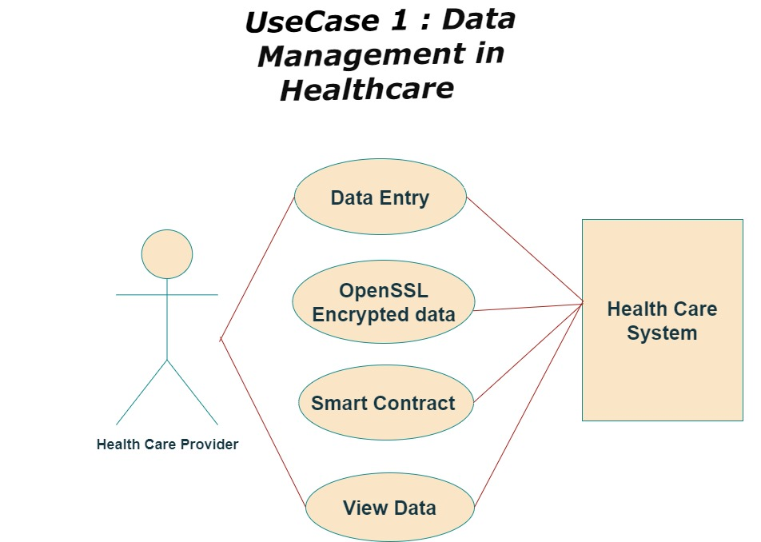
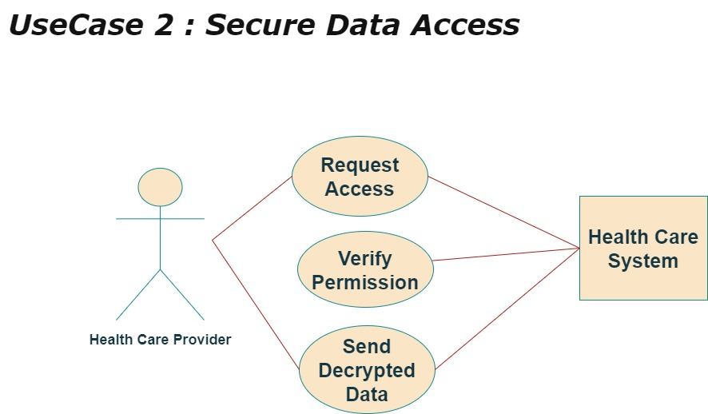
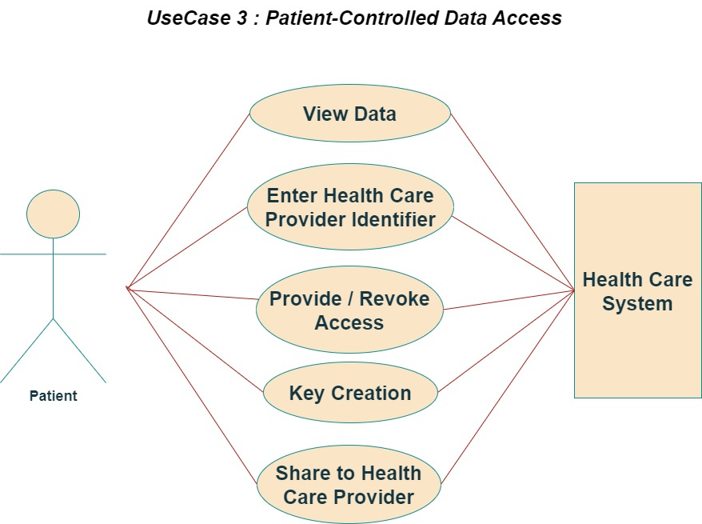

This is the full-stack proof of concept for the DocNet sovereign data management system. It consists of a Django backend for patient and doctor information dashboards with web3 integration, a vanilla js frontend using web3.js for access management, data encryption/decryption and uploading to smart contract storage, and a smart contract which gives patients control over granting and revoking database write permissions for health care providers.

## Moralis_Auth

This is a Django app that uses Moralis's Auth system to authenticate users, and provides a proof of concept admin dashboard for showing patient information including health records and healthcare providers.

## Contract-Frontend

This directory hosts the frontend for interacting with the smart contract and encrypting/decrypting patient data. It uses AES-256 encryption as a proof of concept, and uses web3.js for interacting with the DocNet smart contract. 

## Hardhat

The DocNet smart contract is hosted here. It handles granting and revoking database write permissions for health care providers, and also acts as a storage medium for encrypted patient data. 

## UC001

## UC002

## UC003

## DocNet Smart Contact Deployments

[Avalanche Fuji Testnet](https://testnet.snowtrace.io/address/0xf8f0faD8f4e3B5027Fc194977a8d51772837ef24)

[Sepolia Testnet](https://sepolia.etherscan.io/address/0xDF43d45aCcBdAF1025b3aa8693F226F5DdccBfCc)

